# ERP CAFE SYSTEM

카페 운영에 필요한 전반적인 업무를 통합 관리하는 웹 기반 ERP 시스템입니다.  
주문, 재고, 인사, 재무, 수익 분석까지 하나의 플랫폼에서 처리할 수 있으며,  
**Prophet ML 기반 수익 예측**과 **Claude AI 재무 분석 리포트** 기능을 포함합니다.

---

## 주요 기능

### 대시보드
- 오늘의 매출 / 주문건수 요약 카드
- 주간 매출 현황 차트 (Chart.js)
- 재고 부족 원재료 알림 (발주 진행 중인 항목 자동 제외)
- 금일 근무자 현황 (출근 중 → 퇴근 → 미출근 / 직급순 정렬)

### 제품관리
- 메뉴 등록 / 수정 / 삭제
- 메뉴별 레시피(원재료 구성) 관리
- 카테고리 분류

### 재고관리
- 원재료 재고 현황 (카테고리 / 상태 / 키워드 필터링)
- 재고 상태 표시: 부족 / 주의 / 정상
- 거래처 관리 (계약서 파일 첨부 지원)
- 발주 등록 및 발주 내역 조회
- 발주 입고 완료 시 재고 자동 증가 + 재고 변동 로그 기록

### 주문관리
- 주문 내역 조회 및 상태 관리 (완료 / 취소 등)
- 주문 상세 보기

### 인사관리 (점장 전용)
- 직원 등록 / 수정 / 삭제 (페이징 + 검색)
- 근태 달력: 월별 출근 현황 집계
- 근태 상세: 일별 출근/퇴근 시각 조회 및 수정
- ERP 사용자 계정 관리

### 재무관리
- 지출 내역 등록 / 조회 (영수증 OCR 자동 인식 — CLOVA OCR)
- 급여 내역 조회 (점장 전용)

### 수익 분석 (AI 연동)
- **수익 통계**: 기간별 매출/지출/순이익 통계
- **수익 예측**: Prophet ML (Facebook Research) 기반 향후 6개월 매출 예측
  - 95% 신뢰 구간(예측 범위 상한/하한) 제공
  - 데이터 3개월 미만 시 Holt's 이중지수평활법으로 자동 전환
- **AI 재무 분석 리포트**: Prophet 예측 결과 + 재무 현황을 Claude API에 전달하여 경영 평가 및 개선안 자동 생성
- **재고 소진 추이 예측**: 원재료별 소진 속도 예측 및 발주 시점 제안

### 공지사항
- 공지 등록 / 조회 (중요도: 긴급 / 중요 / 일반)
- 헤더 알림 벨 — 마지막 확인 이후 새 공지 뱃지 표시

### 프로필
- 사이드바 프로필 사진 변경 (이미지 업로드 → DB 저장 → 세션 갱신)

---

## 기술 스택

### Backend
| 구분 | 기술 |
|---|---|
| Framework | Spring Boot 4.0.3 |
| View | JSP + JSTL |
| ORM | MyBatis 4.0.1 |
| DB | MariaDB |
| Security | Spring Security (BCrypt) |
| OCR | NAVER CLOVA OCR API |

### AI / 분석 서버 (DAP)
| 구분 | 기술 |
|---|---|
| Framework | FastAPI (Python) |
| AI 분석 | Claude claude-haiku-4-5 (Anthropic API) — 재무 리포트 생성 |
| 수익 예측 | Prophet >= 1.1.5 (Facebook Research) — ML 기반 시계열 예측, 95% 신뢰 구간 |
| 예측 Fallback | Holt's 이중지수평활법 — 데이터 부족 시 자동 전환 |
| 재무 분석 | 분개장, 손익계산서, 대차대조표, 현금흐름표 자동 생성 |
| 재고 예측 | 일평균 소비량 기반 소진 예정일 계산 |
| 기타 | pandas >= 2.0.0, openpyxl (엑셀 내보내기) |

### Frontend
| 구분 | 기술 |
|---|---|
| 차트 | Chart.js 4.4.1 |
| 스타일 | CSS Variables 기반 디자인 시스템 |
| 마크다운 렌더링 | 커스텀 파서 (AI 리포트 출력용) |

---

## 프로젝트 구조

```
ERP_Project/
├── ERP/                        # Spring Boot 메인 애플리케이션
│   └── src/main/
│       ├── java/com/example/demo/
│       │   ├── controller/     # MVC 컨트롤러
│       │   ├── Service/        # 비즈니스 로직
│       │   ├── mapper/         # MyBatis 매퍼 인터페이스
│       │   └── Domain/         # 도메인 모델
│       ├── resources/
│       │   ├── mapper/         # MyBatis XML 쿼리
│       │   └── static/css/     # 모듈별 CSS
│       └── webapp/WEB-INF/views/
│           ├── MainPage.jsp
│           ├── Analysis/       # 수익 분석 3종
│           ├── Finance/        # 지출/급여
│           ├── Ingredients/    # 재고/거래처/발주
│           ├── Order/          # 주문
│           ├── Product/        # 메뉴/레시피
│           ├── hr/             # 인사/근태
│           └── Notice/         # 공지사항
└── DAP/                        # Python FastAPI 분석 서버
    ├── main.py                 # FastAPI 엔트리포인트
    ├── processing/
    │   ├── analysis.py         # Claude AI 재무 분석
    │   ├── forecast_revenue.py # 매출 예측
    │   ├── forecast_inventory.py # 재고 소진 예측
    │   ├── income.py           # 손익계산서
    │   ├── balance.py          # 대차대조표
    │   ├── cashflow.py         # 현금흐름표
    │   └── journal.py          # 분개장
    └── requirements.txt
```

---

## 권한 구조

| 기능 | 스탭 | 매니저 | 점장 |
|---|:---:|:---:|:---:|
| 대시보드 | O | O | O |
| 제품/재고/주문 관리 | O | O | O |
| 수익 분석 | O | O | O |
| 재무 지출 내역 | O | O | O |
| 거래처 관리 | - | - | O |
| 인사/근태 관리 | - | - | O |
| 급여 내역 | - | - | O |
| ERP 사용자 관리 | - | - | O |

---

## 실행 방법

### 사전 요구사항
- Java 17+
- Python 3.10+
- MariaDB

### Python 의존성 설치
```bash
cd ERP/DAP
pip install -r requirements.txt
```

> **Windows 환경 주의**: `prophet` 첫 설치 시 `cmdstanpy` 컴파일이 진행되어 시간이 걸릴 수 있습니다.  
> 설치 확인: `python -c "from prophet import Prophet; print('OK')"`

### Spring Boot 실행
```bash
cd ERP
./mvnw spring-boot:run
```

Spring Boot 시작 시 `UvicornLauncher`가 FastAPI 분석 서버(포트 8000)를 자동으로 함께 실행합니다.

### FastAPI 분석 서버 단독 실행 (선택)
```bash
cd ERP/DAP
uvicorn server:app --host 127.0.0.1 --port 8000
```

### 환경 변수 설정 (DAP/.env)
```
ANTHROPIC_API_KEY=your_api_key_here
```

---

## 스크린샷

### 로그인
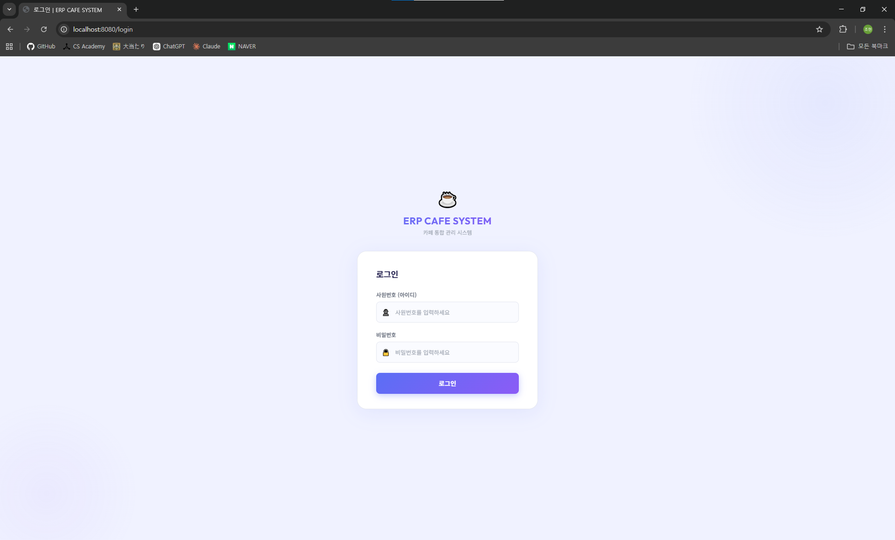

### 업무 대시보드
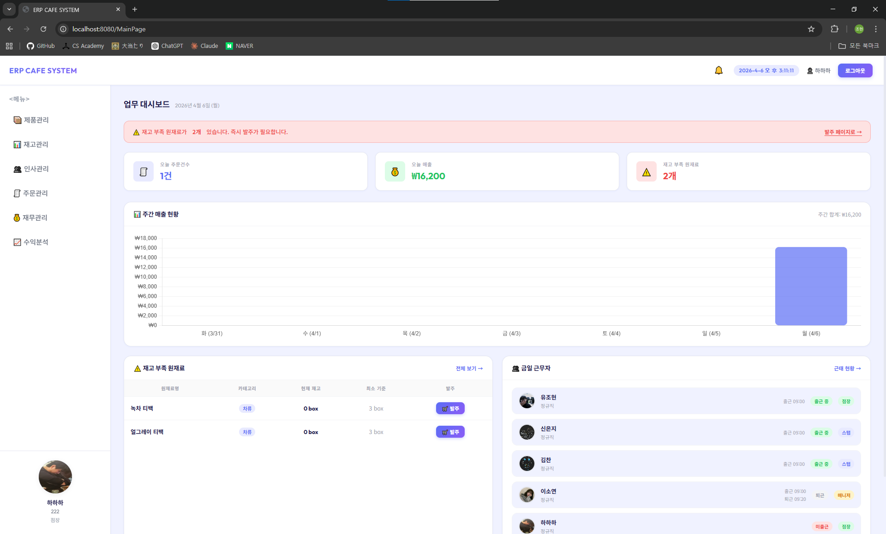

### 제품 관리
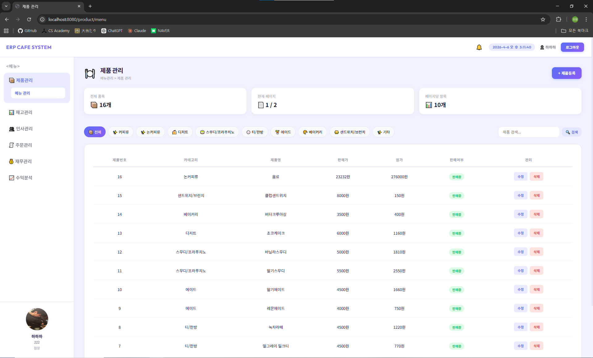

### 재고 현황
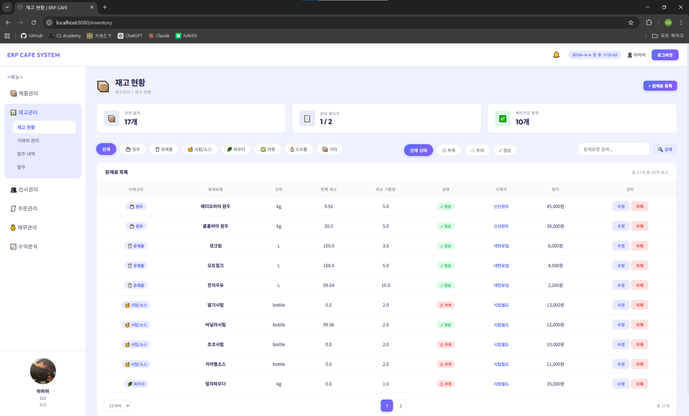

### 거래처 관리
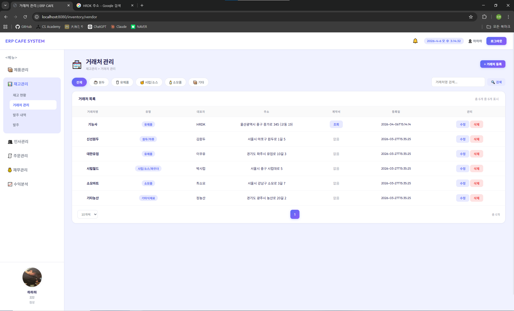

### 발주 내역
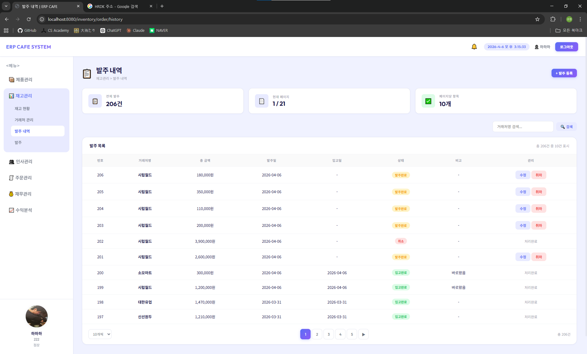

### 발주 등록
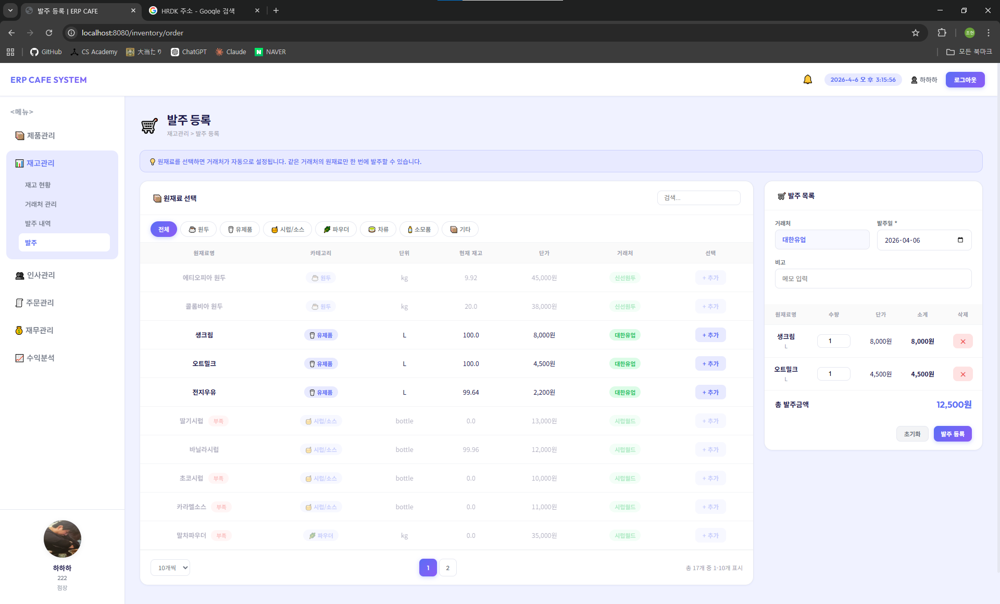

### 근태 관리
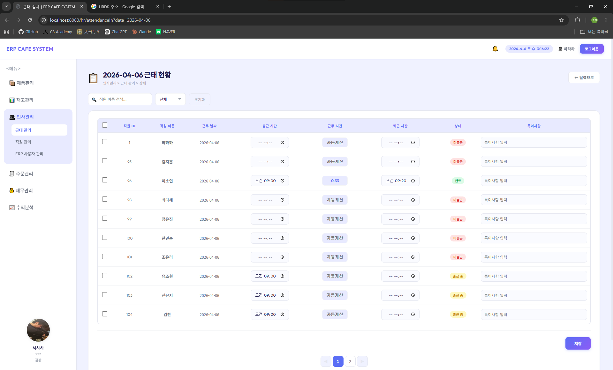

### 직원 관리
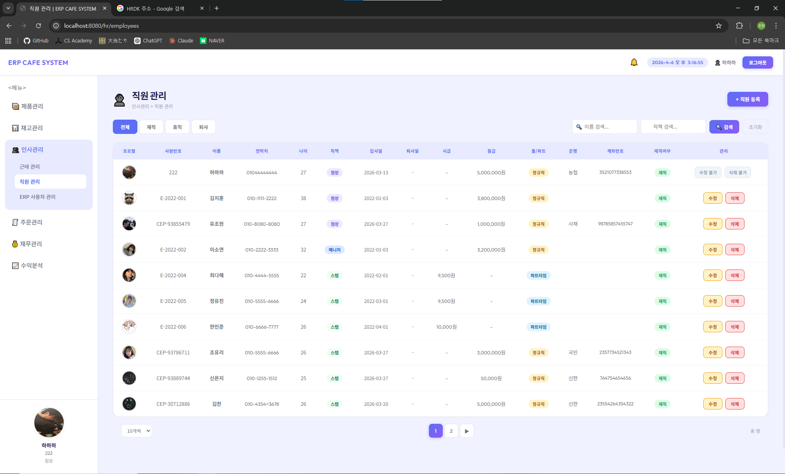

### ERP 사용자 관리
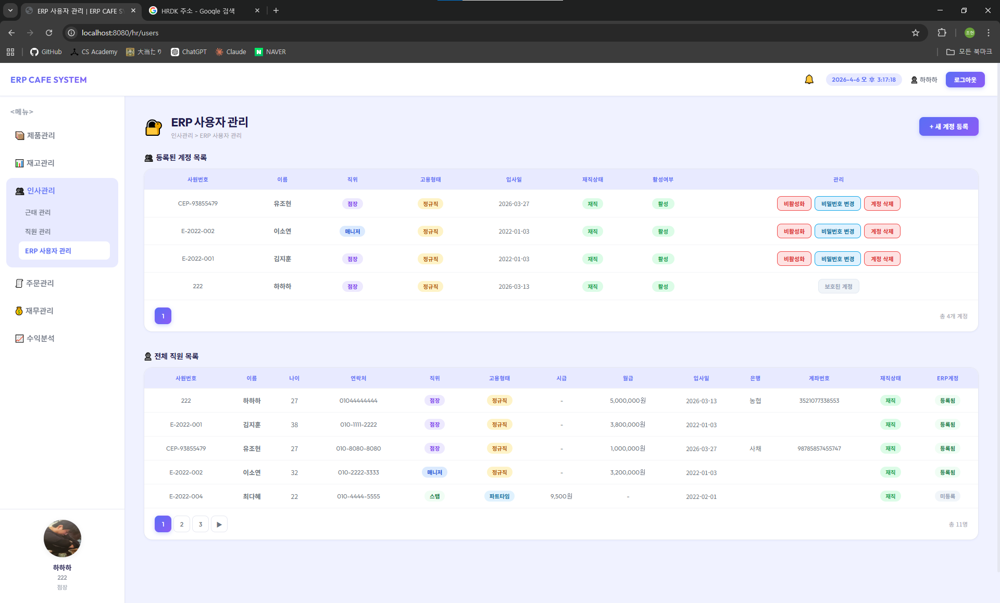

### 주문 내역
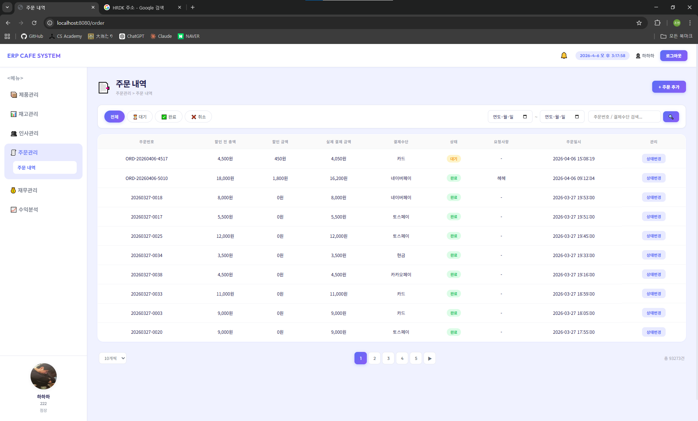

### 지출 내역
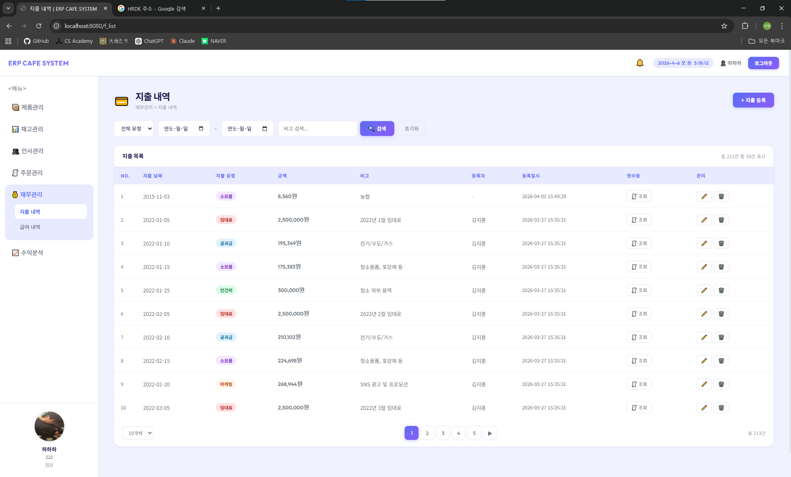

### 급여 내역


### 수익 통계
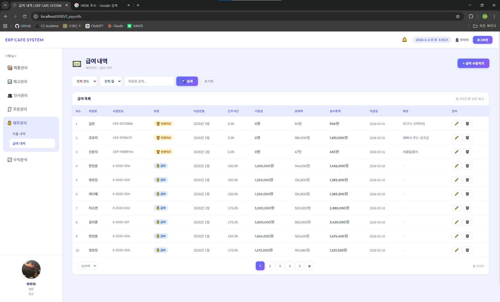

### 수익 예측
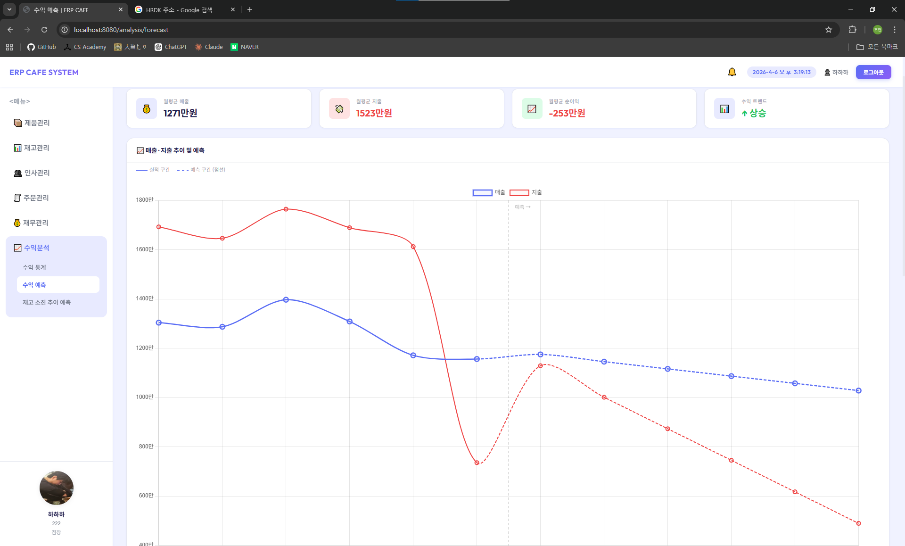

### 재고 소진 추이 예측
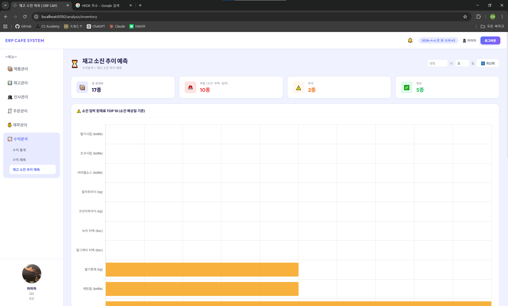

### 공지사항
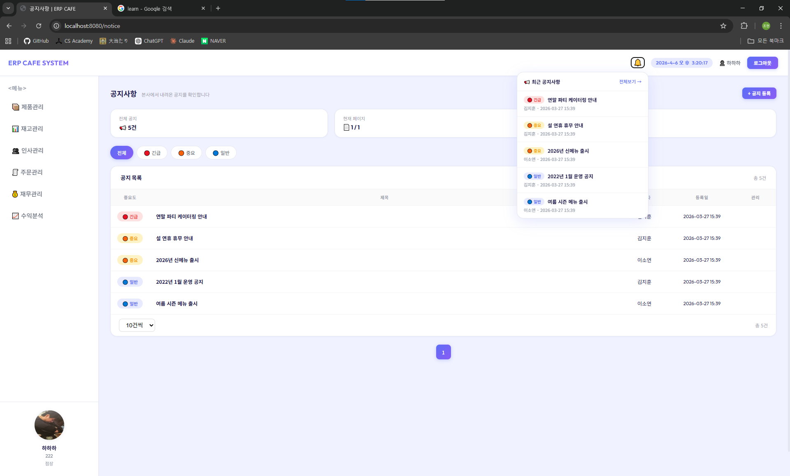

---

## 팀원

| 이름 | 역할 |
|---|---|
| 유조현(팀장) | SW 아키텍처 설계, 재무관리, 주문관리, 수익 분석 알고리즘, OCR 및 문장 생성 AI 연동, 전체 UI 통합, RPA 구현 |
| 김찬 | DB 스키마 설계, 재고관리, 수익 분석 UI, 업무 대시보드, 공지사항, 프로필 |
| 신은지 | UX/UI 디자인 설계, 헤더 및 사이드바, 메뉴관리, RPA 보고서 템플릿 설계 |
| 이연우 | 기능 설계, 인사관리, 계정 인증/인가(AAA), REST API 구축 |